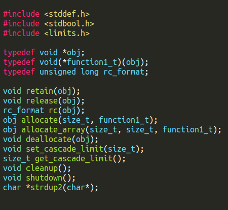

# Design Documentation
Here follows an introductionary description of the design and functionality of the reference counting garbage collector implemented
by the project group Gulhämplingarna.

## Overview
The header file consists of the following functions.



## retain
```c
void retain(obj);
```
## release
```c
void release(obj);
```

## rc
```c
rc_format rc(obj);
```

## allocate
```c
obj allocate(size_t, function1_t );
```

## allocate_array
```c
obj allocate_array(size_t, size_t, function1_t);
```

## deallocate
```c
void deallocate(obj);
```

## set_cascade_limit
```c
void set_cascade_limit(size_t);
```

## get_cascade_limit
```c
size_t get_cascade_limit();
```

## cleanup
```c
void cleanup();
```

## shutdown
```c
void shutdown();
```

## strdup2
```c
char* strdup2(char*);
```
